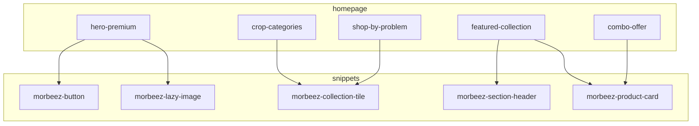

# 02 — Homepage Sections & Component Breakdown

## UX principles (Katyayani-inspired, cleaner)

- **Trust first:** certifications, farmer count, delivery coverage in hero subcopy
- **Wayfinding:** crop + problem paths above the fold on mobile (horizontal scroll chips)
- **Low cognitive load:** max 2 CTAs per section; primary = shop, secondary = WhatsApp/advisory
- **Indian context:** ₹ pricing, regional crop imagery, vernacular CTA labels via i18n (not hardcoded Malayalam in Liquid)

---

## Section specifications

### 1. `hero-premium`

| Setting | Type | Notes |
|---------|------|-------|
| Image / mobile image | image_picker | Separate art direction for mobile |
| Heading | text (locale key fallback) | Single H1 for homepage |
| Subheading | richtext | |
| Primary CTA | url + label | Default: featured collection |
| Secondary CTA | url + label | WhatsApp or advisory |
| Trust badges | blocks (icon + text) | Max 4 |
| Overlay opacity | range | Readability on photos |

**Snippet:** `morbeez-lazy-image`, `morbeez-button`  
**Performance:** First slide image `fetchpriority="high"`, width 1920 max

---

### 2. `crop-categories`

| Block | Fields |
|-------|--------|
| category_tile | image, title, collection link, optional crop metafield handle |

**Alternative:** `collection_list` setting linking to parent `shop-by-crop` children.

**Mobile:** Horizontal scroll (`overflow-x-auto`, snap).  
**Desktop:** 4–6 column grid.

---

### 3. `shop-by-problem`

Same tile pattern as crop; visual language uses problem icons (leaf spot, pest, deficiency).

Link to `problem-*` collections. Optional tag filter display on card.

---

### 4. `featured-collection`

| Setting | Type |
|---------|------|
| collection | collection |
| products_to_show | range 4–12 |
| columns_desktop / columns_mobile | select |
| show_view_all | checkbox |

**Snippet:** `morbeez-product-card`  
Show: image, title, price, compare_at, unit (from variant option or metafield `morbeez.pack_size`), badge.

---

### 5. `combo-offer`

Blocks: `combo_card` — image, title, products (product list via blocks linking to handles), savings text, CTA.

Or single collection `combos` with subheading in section settings.

---

### 6. `testimonials`

Blocks: `testimonial` — quote, name, location, crop type, rating, optional image.

Carousel on mobile (CSS scroll-snap); grid on desktop.

---

### 7. `blog-preview`

| Setting | Type |
|---------|------|
| blog | blog |
| articles_count | range |
| show_tags | checkbox |

Card: image, title, excerpt, read time (metafield optional later).

---

### 8. `seasonal-campaign`

Full-width banner: monsoon / kharif / rabi — image, gradient overlay, heading, CTA, optional end date (display only).

Link to seasonal collection `season-monsoon-2026`.

---

### 9. `flash-sale`

| Setting | Type |
|---------|------|
| collection | collection |
| end_datetime | text (ISO) | Validated in JS |
| badge_text | text |

Countdown + product row. Sold-out state hides ATC, shows "Notify" placeholder (M2).

---

### 10. `advisory-education`

Blocks: `education_card` — icon, title, excerpt, link (blog article or page).

Supports "Learn" pillar without AI yet.

---

### 11. `sticky-whatsapp-cta`

Global in layout.

| Setting | Type |
|---------|------|
| phone | text (E.164) |
| default_message | textarea |
| show_on_mobile / desktop | checkbox |
| bottom_offset | range (above mobile nav) |

```html
<a href="https://wa.me/{{ phone }}?text={{ message | url_encode }}"
   data-morbeez-whatsapp-cta
   aria-label="{{ 'general.whatsapp.contact' | t }}">
```

Future: replace `href` via app embed when WATI/Cloud API tracking needed.

---

### 12. `ai-crop-doctor-cta`

Prominent card section — **no AI in M1**.

| Setting | Type |
|---------|------|
| enabled | checkbox (theme setting mirror) |
| heading / body | text |
| cta_url | url (page `/pages/crop-doctor` placeholder) |
| icon | image |

`data-morbeez-feature="crop-doctor"` for analytics hook.

---

### 13. `dealer-enquiry-cta`

Banner + button → `/pages/dealer-enquiry` (Shopify Form or contact page).

`data-morbeez-feature="dealer-enquiry"`

---

## Component dependency graph



---

## Responsive breakpoints

| Token | Width | Usage |
|-------|-------|-------|
| default | 0–639px | Single column, sticky CTAs |
| `sm` | 640px | 2-col product grid |
| `md` | 768px | Mega menu visible |
| `lg` | 1024px | 4-col categories |
| `xl` | 1280px | Max content width 1280px centered |

**Container:** `max-w-7xl mx-auto px-4 sm:px-6 lg:px-8`

---

## Conversion patterns

- Product cards: entire card clickable; ATC icon secondary on hover (desktop)
- WhatsApp: prefilled message includes `{{ page.title }}` via JS when on PDP
- Problem/crop tiles: show product count if `collection.products_count` available

---

## Theme Editor experience

Group sections in preset labeled **"Morbeez Homepage"** with ordered blocks pre-populated for staging demo.

Document for client: *Settings → Customize → Home page → add/reorder sections from Morbeez group.*
