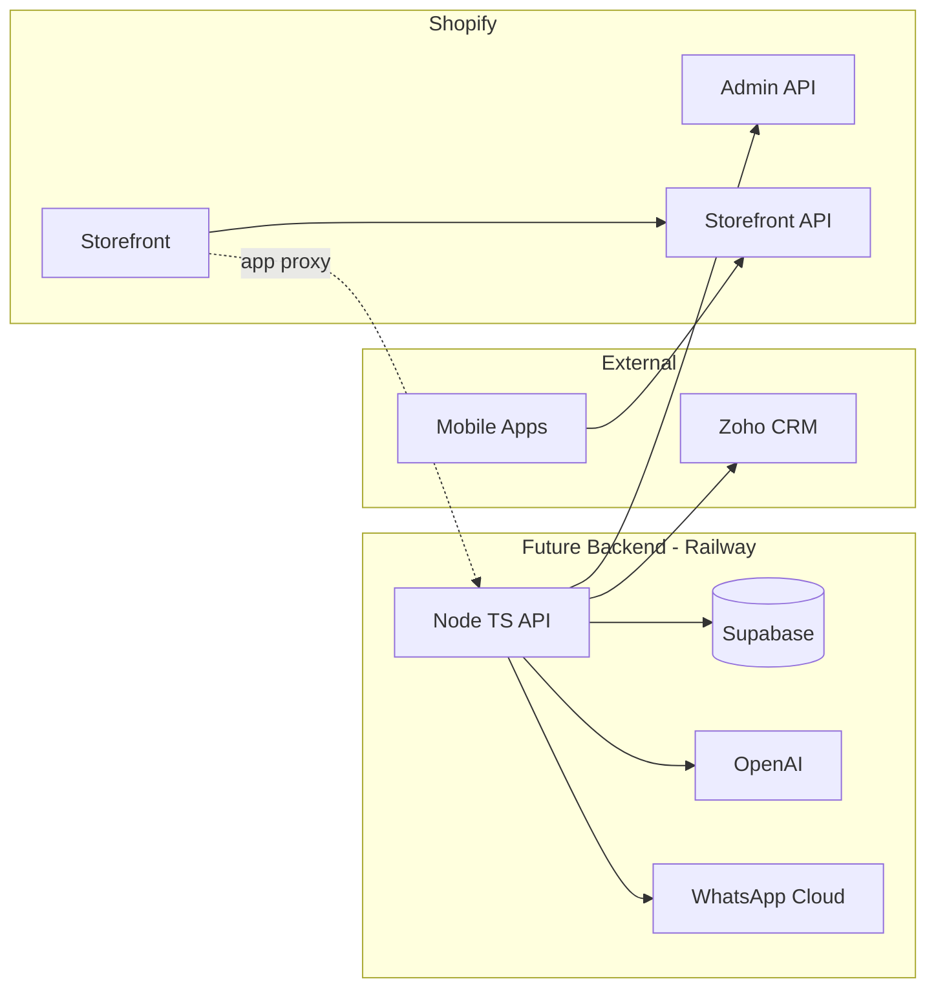

# 08 — Future Scalability & Integration Readiness

## System context (target state)

M1 delivers the **Shopify layer** with hooks; no Railway deploy yet.

---

## Integration hooks in theme (M1)

| Feature | Hook | Location |
|---------|------|----------|
| WhatsApp | `data-morbeez-whatsapp`, phone setting | `sticky-whatsapp-cta`, PDP |
| Crop Doctor | `data-morbeez-feature="crop-doctor"`, URL setting | Section + page template |
| Dealer enquiry | Form action / page handle | `dealer-enquiry-cta` |
| Farmer profile | `customer.metafields.morbeez.*` | Account template M3 |
| Analytics events | `data-morbeez-event` | CTAs for GTM later |

---

## App proxy routes (M2 plan)

| Path | Purpose |
|------|---------|
| `/apps/morbeez/crop-doctor` | Symptom upload UI |
| `/apps/morbeez/recommendations` | JSON product handles |
| `/apps/morbeez/whatsapp-webhook` | HMAC verified |

Theme links use relative app proxy paths when app installed; fallback to placeholder pages in M1.

---

## Storefront API (mobile-ready)

Mobile apps should use:

- `product(handle)` — same handle as web URL  
- Metafields exposed via `MetafieldStorefrontVisibility`  
- Cart via Checkout Sheet Kit / cart API

**M1 task:** Register metafield definitions with storefront access for:

- `morbeez.target_crops`
- `morbeez.dosage_instructions`
- `morbeez.benefits`
- `morbeez.ai_product_slug`

---

## Supabase farmer profiles (M3)

| Shopify | Supabase |
|---------|----------|
| `customer.id` | `profiles.shopify_customer_id` |
| `morbeez.farmer_profile_id` | `profiles.id` |

Webhook: `customers/create` → API → Supabase insert.

---

## WhatsApp workflows (M2)

1. Click tracking on `wa.me` links (UTM + `ref`)  
2. Replace with WATI widget or Cloud API template messages  
3. Order notifications via Shopify Flow → API → WhatsApp  
4. Opt-in stored in `morbeez.whatsapp_opt_in`

---

## AI Crop Doctor (M3)

- Symptom image → OpenAI vision → `symptom_keywords` match → products with `morbeez.ai_recommendation_tags`  
- Results page template `page.crop-doctor-results.json`  
- Collection `ai-*` auto-populated via Admin API nightly

**M1:** Placeholder page explaining coming soon; CTA captures emails via form if desired.

---

## Zoho CRM (M3)

| Event | Sync |
|-------|------|
| Dealer form submit | Lead in Zoho |
| Order paid | Deal + line items |
| Customer tag `dealer` | Account module |

Use SKU ↔ `morbeez.external_crm_id` metafield.

---

## Affiliate / seasonal (M4+)

- Customer tags `affiliate-{code}`  
- Shopify Functions for discount rules  
- Seasonal metaobjects drive homepage `seasonal-campaign` section via metaobject list setting (upgrade from manual blocks)

---

## Technical debt guardrails

- Keep business logic out of Liquid — only presentation  
- Complex rules live in future API; Liquid reads metafields only  
- Document every `data-morbeez-*` attribute in this file
