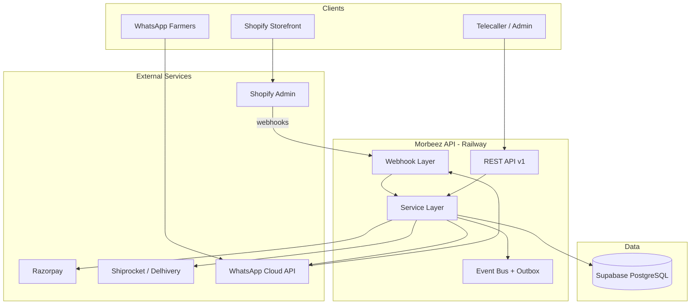

# M2 — Backend Architecture

## System context



## Layer responsibilities

| Layer | Responsibility |
|-------|----------------|
| **Routes** | HTTP, validation, auth, raw body for webhooks |
| **Services** | Business logic, external API calls |
| **Events** | Side effects, async-ready outbox |
| **Lib** | Supabase client, logger, typed errors |

## Design decisions

1. **Single deployable** — one Fastify service on Railway (not microservices yet).
2. **Shopify = catalog + standard checkout** — API syncs orders, does not replace checkout.
3. **Razorpay** — payment links, COD reconciliation, B2B quotations.
4. **Shiprocket** — single integration; Delhivery via SR courier rules.
5. **WhatsApp** — provider interface (`cloud` | `wati` | `interakt`).
6. **Supabase** — source of truth for farmers, leads, interaction history.

## Service modules

```
services/
  shopify/     → Admin API + order webhooks
  razorpay/    → Payment links + payment webhooks
  shiprocket/  → Shipment create + tracking webhooks
  whatsapp/    → Inbound/outbound + intent classification
  farmer/      → Profile CRUD
  crm/         → Leads, quotations, callbacks
```

## API versioning

Prefix: `/api/v1/`. Breaking changes → v2 with parallel run period.
