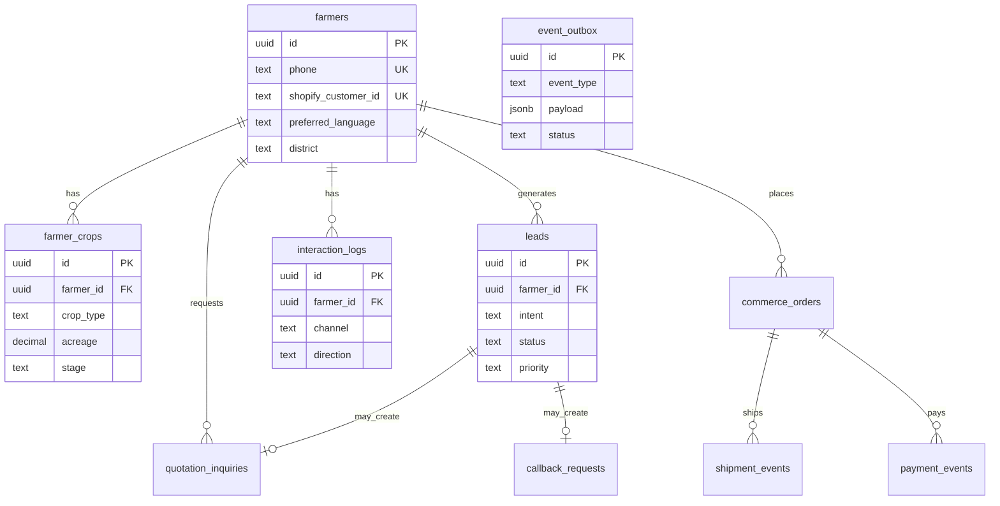

# M2 — Supabase Schema Design

Migration: [`supabase/migrations/20260523000000_m2_foundation.sql`](../../supabase/migrations/20260523000000_m2_foundation.sql)

## ER diagram (core)

## Table purposes

| Table | Purpose |
|-------|---------|
| `farmers` | Master farmer identity (phone unique) |
| `farmer_crops` | Crop portfolio per farmer |
| `leads` | CRM leads with intent + telecaller status |
| `quotation_inquiries` | B2B/quote workflow before checkout |
| `callback_requests` | Scheduled callback queue |
| `commerce_orders` | Shopify order mirror |
| `payment_events` | Razorpay audit trail |
| `shipment_events` | AWB + tracking history |
| `interaction_logs` | WhatsApp/SMS/web history |
| `webhook_logs` | Idempotency + debug |
| `event_outbox` | Automation queue (M3) |
| `crm_sync_queue` | Zoho outbound (M3) |

## Future tables (M3 — not migrated yet)

- `disease_history`
- `yield_history`
- `ai_advisory_logs`
- `recommendation_history`

Columns reserved in `farmers.metadata` JSONB until normalized.

## Indexes strategy

- Phone lookup (WhatsApp inbound)
- Lead status (telecaller dashboard)
- Webhook idempotency unique constraint
- Outbox `status + created_at` for worker poll

## RLS

M2: **service role only** from API. M3: farmer-facing app uses anon key + policies on own `farmer_id`.
